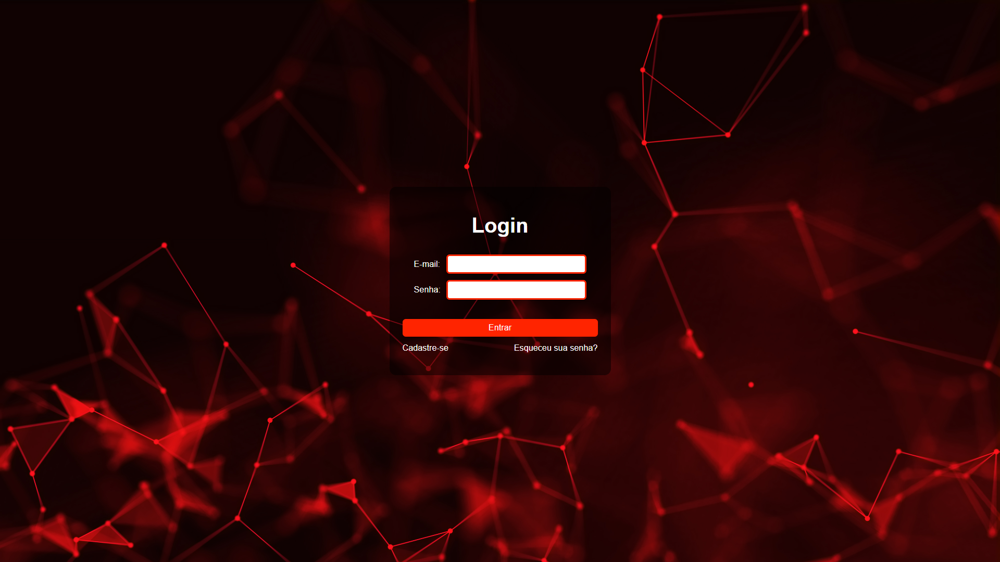

# Tela de Login

## [Ver projeto online](https://kaiqueurban.github.io/TelaDeLogin/)

Interface de login desenvolvida com HTML5 e CSS3, com foco em estrutura semântica, acessibilidade e boas práticas de estilização.



## Tecnologias

- HTML5
- CSS3 (Flexbox, Box Model)

## Funcionalidades

- Formulário de login com campos de e-mail e senha
- Validação nativa (`required`, `type="email"`)
- Layout responsivo e centralizado
- Efeito hover nos links de navegação

## Como executar

```bash
git clone git clone https://github.com/KaiqueUrban/TeladeLogin.git
```

Abra o arquivo `telaDeLogin.html` no navegador, ou utilize a extensão **Live Server** (VSCode) para uma melhor experiência de desenvolvimento.

## Estrutura do projeto

```
tela-login/
├── telaDeLogin.html
├── style.css
└── Imagens/
    └── background.jpg
```

## Roadmap

- [ ] Validação de formulário com JavaScript
- [ ] Redirecionamento pós-login
- [ ] Cadastro e recuperação de senha com back-end (Node.js) e banco de dados

## Autor

**Kaique Urban**
[LinkedIn](https://www.linkedin.com/in/kaiqueurban) · [GitHub](https://github.com/kaiqueurban)
